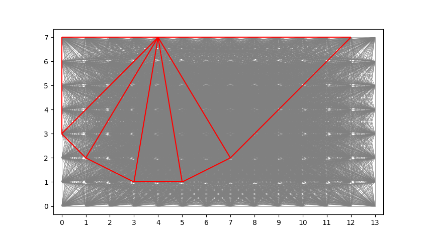

## DLOpy
Efficient Python implementation (Scipy/Numba) of [Discontinuity Layout Optimisation](https://en.wikipedia.org/wiki/Discontinuity_layout_optimization) (DLO) for testing the Python ecosystem with Linear Programming problems cast for assessing geotechnical failure mechanisms.

This repository is intended solely for research purposes and accessible demonstration/discovery with Python to develop the awareness of engineering problems and numerical methods cross-industry. For commercial use please see [LimitState:GEO](https://www.limitstate.com/geo).

### Development & Use 
Clone the repository ensuring the dependencies in the requirements file are satisfied within the Python interpreter environment in use, then start by running the files in the tests and examples folders.

Alternatively, to install within an environment in use and run as demonstrated in the examples: 

    pip install git+https://github.com/dlincoln/dlopy

### Prandtl Failure Mechanism

